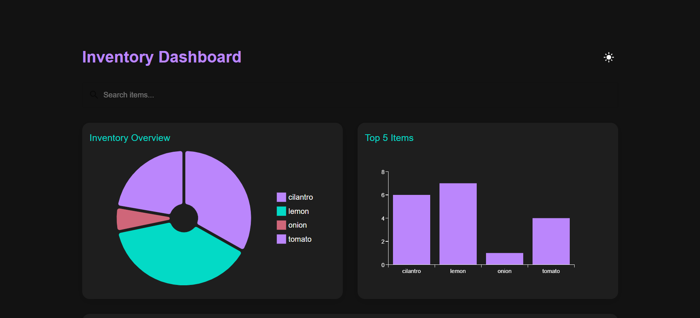

# AI-Powered Food Inventory Management System

## Project Overview

This project is an AI-powered Inventory Management System specifically designed for food items, developed as part of the Headstarter AI Fellowship. It features real-time inventory tracking, AI-powered image recognition for adding items, and smart recipe suggestions based on available ingredients.



## 🌟 Features

- Real-time inventory tracking
- AI-powered image recognition for adding items
- Smart recipe suggestions based on available ingredients
- Dark mode for comfortable viewing
- Search functionality for quick item lookup
- Responsive design for various screen sizes

## 🛠️ Technologies Used

- [Next.js](https://nextjs.org/)
- [React](https://reactjs.org/)
- [Firebase](https://firebase.google.com/)
- [OpenAI API](https://openai.com/api/)
- [Material-UI](https://material-ui.com/)
- [Framer Motion](https://www.framer.com/motion/)

## 🚀 Live Demo

Check out the live demo deployed on Vercel: [\[Click Here!\]](https://inventory-management-ochre.vercel.app/)

## 🏁 Getting Started

To get a local copy up and running, follow these steps:

1. Clone the repository:


```bash
git clone https://github.com/miyannishar/food-inventory-management.git
```

2. Navigate to the project directory:

```bash
cd food-inventory-management
```

3. Install dependencies:
```bash
npm install
```

4. Set up environment variables:
Create a `.env.local` file in the root directory and add the following:

```bash
OPENAI_API_KEY=your_openai_api_key
```

5. Run the development server:

```bash
npm run dev
```

6. Open [http://localhost:3000](http://localhost:3000) with your browser to see the result.

## 🐛 Troubleshooting

If you encounter any issues while setting up or running the project, try the following:

1. Ensure all dependencies are installed:
```bash
npm install
```

2. Clear Next.js cache:
```bash
rm -rf .next
```

3. Rebuild the project:
```bash
npm run build
```

4. For OpenAI API issues, verify that your API key is correctly set in the `.env.local` file and that you have sufficient credits in your OpenAI account.

6. If you're encountering CORS issues with the OpenAI API, ensure that your serverless function (in `pages/api/object-detection.js`) is correctly configured to handle the API request.

## 🤝 Contributing

Contributions, issues, and feature requests are welcome! Feel free to check [issues page](https://github.com/miyannishar/inventory-management/issues).


## 👤 Author

**Nishar Miya**

- LinkedIn: [Nishar Miya](https://www.linkedin.com/in/nishar-miya/)
- GitHub: [@miyannishar](https://github.com/miyannishar)

## 🙏 Acknowledgments

- Headstarter AI Fellowship for the opportunity and support
- OpenAI for providing the powerful API
- All contributors and reviewers
